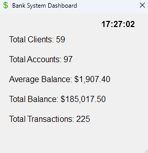
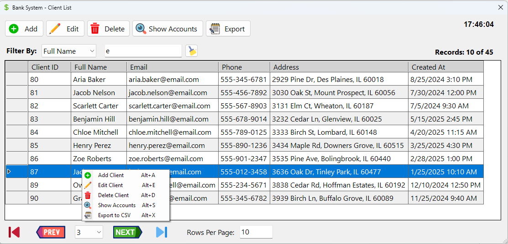
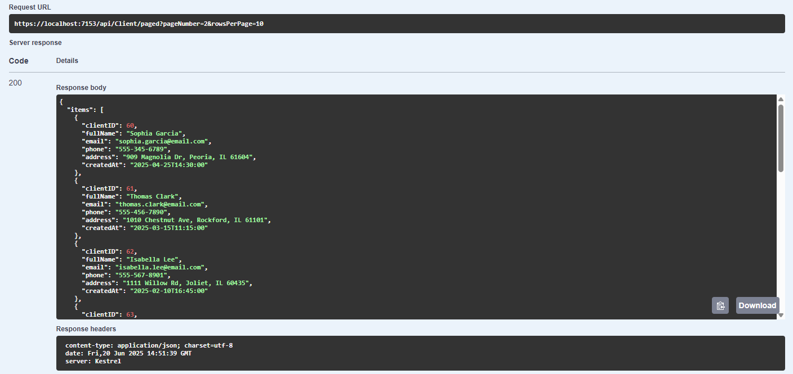
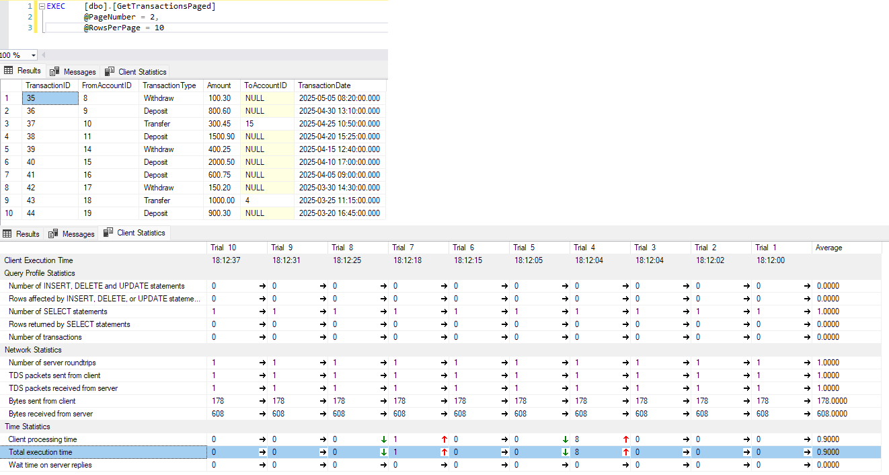

# BankSystem

A C# Windows Forms banking application with an ASP.NET Core API, using a 3-tier architecture (Data Access, Business, Presentation) for managing clients, accounts, and transactions. Features dynamic filtering, dynamic form resizing, real-time validation, and SQL Server integration. Work-in-progress with planned authentication and currency support.

## Features

- **3-Tier Architecture with API**: SQL Server Data Access via optimized stored procedures (`SET NOCOUNT ON` to reduce network traffic, parameterized queries), Business logic, WinForms UI, and RESTful API.
- **Client Management**: Add, edit, delete, filter (ID, name, email, phone, address), view accounts; unique email/phone validation.
- **Account Management**: Add, edit, delete, filter (ID, client, balance), view client/transactions.
- **Transaction Management**: Deposit, Withdraw, Transfer; filter by account, type, amount, date.
- **Dashboard**: Displays total clients, accounts, transactions, and balance metrics.
- **Dynamic Filtering**: Real-time search (~300ms debounce) with reflection-based dropdowns.
- **Dynamic Resizing**: Forms resize to fit `DataGridView` content, respecting initial width to keep controls visible.
- **UI Enhancements**: Resizable forms, sortable grids, CSV export, shortcuts (Alt+A, Alt+E, Escape), context menus, double-click navigation.
- **Validation**: Real-time checks for email, phone (10-digit), amounts, IDs.
- **API**: CRUD operations via `https://localhost:7153/api` (Swagger-documented).
- **Database**: Normalized tables (`Clients`, `Accounts`, `TransactionsBase`, `TransactionTypes`), views, triggers, and stored procedures.

## API Endpoints

Base URL: `https://localhost:7153/api`

- **Client**: GET `/Client/paged`, `/Client/{id}`, `/Client/Filter`, `/Client/Summary`; POST, PUT, DELETE `/Client`.
- **Account**: GET `/Account/paged`, `/Account/ByClient/{clientId}`, `/Account/{id}`, `/Account/Summary`; POST, PUT, DELETE `/Account`.
- **Transaction**: GET `/Transaction/paged`, `/Transaction/ByAccount/{fromAccountId}`, `/Transaction/Summary`; POST `/Transaction`.

## Database

- **SQL Server**: Tables (`Clients`, `Accounts`, `TransactionsBase`, `TransactionTypes`), view (`Transactions`), triggers for view CRUD, stored procedures for paged/filtered queries.
- **Constraints**: Foreign keys with cascade delete, unique `TransactionTypeName`.

## Technologies

- **Frontend**: C#, Windows Forms, .NET 8.0
- **Backend**: ASP.NET Core Web API
- **Database**: SQL Server 2022, Microsoft.Data.SqlClient
- **Tools**: Visual Studio 2022, Git, Swagger

## Prerequisites

- Visual Studio 2022
- SQL Server
- .NET 8.0 SDK

## Setup

1. Clone: `git clone https://github.com/Mahmoud-Elshaer-10/BankSystem.git`
2. Database:
   - Run `BankSystem.sql` for schema and sample data.
   - Update `C_API/appsettings.json` connection string: `Server=.;Database=BankSystem;Integrated Security=True;`.
3. Run:
   - Open `BankSystem.sln` in Visual Studio.
   - Ensure `ApiClient.cs` uses `https://localhost:7153/api/`.
   - Set `WinForms + API` profile.
   - Build and run (F5).

## Usage

- **MainForm**: Navigate to Clients (Alt+C), Accounts (Alt+A), Transactions (Alt+T), or Dashboard (Alt+D).
- Filter records, sort grids, export to CSV, use shortcuts, or double-click to view related data (e.g., client to accounts).

## Screenshots

### Main Dashboard

  
Shows total clients, accounts, transactions, and balance metrics in WinForms UI.

### Client List Form

  
Displays client management with dynamic filtering (e.g., by name or email) and pagination.

### API Response

  
RESTful API endpoint (e.g., GET /api/Client/paged) response in Swagger.

### Database Query

  
Stored procedure (e.g., GetTransactionsPaged) output in SSMS, 46% faster.

## Code Structure

- **Data Access**: Repository pattern with stored procedures.
- **Business**: Entity-based CRUD logic.
- **API**: RESTful endpoints.
- **Presentation**: WinForms UI with custom controls (sortable grids, formatted buttons), forms, and API integration

## Notes

- Work-in-progress: Authentication and currency support planned.
- Performance: Paginated API, debounced searches, optimized stored procedures.
- Validation: UI and API enforce data integrity.

## Future Improvements

- Implement login using `Users` table.
- Add currency conversions with `Currencies` table.

## License

MIT License - see the [LICENSE](LICENSE) file for details.

## Author

Mahmoud Elshaer  
[GitHub](https://github.com/Mahmoud-Elshaer-10) | [LinkedIn](https://linkedin.com/in/mahmoud-elshaer-b09b9a1a3)
